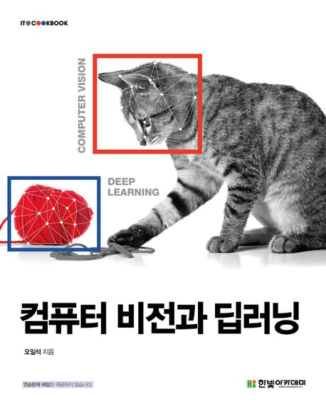

  
<h1 align="center">
  
컴퓨터 비전과 딥러닝

  
</h1>
  
<b>오일석 저</b> 
한빛아카데미 · 2023년 01월 05일 출시  
[[appendix](https://www.hanbit.co.kr/support/supplement_survey.html?pcode=B8870109394)]</b> 

## :bulb: 목표

- **컴퓨터 비전 관련 지식을 공부한다.**

  > 고전 컴퓨터 비전부터 데이터 중심 딥러닝 컴퓨터 비전까지 관련 지식을 폭넓게 공부한다.

 

## 🚩 정리한 문서 목록

 - [attention](https://github.com/erectbranch/Computer_Vision_and_Deep_Learning/tree/master/ch11/summary01)

   > attention, self-attention

   > RNN, LSTM, seq2seq(teacher forcing, auto-regressive), query-key-value, Bahdanau attention

- [Transformer](https://github.com/erectbranch/Computer_Vision_and_Deep_Learning/tree/master/ch11/summary02)

   > word embedding, positional encoding, multi-head attention, feed forward, Masked MHA

 

## :mag: 목차

### Chapter 01 인간의 시각을 흉내 내는 컴퓨터 비전

    1.1 인간의 시각

    1.2 왜 컴퓨터 비전인가?

    1.3 컴퓨터 비전은 왜 어려운가?

    1.4 컴퓨터 비전의 역사

    1.5 컴퓨터 비전 체험 서비스

    1.6 컴퓨터 비전 만들기

    1.7 읽을거리와 볼거리

### Chapter 02 OpenCV로 시작하는 컴퓨터 비전 

    2.1 OpenCV 소개

    2.2 프로그래밍 킥오프

    2.3 객체지향 잘 활용하기

    2.4 [프로그래밍 예제 1] 영상을 읽고 표시하기

    2.5 [프로그래밍 예제 2] 영상 형태 변환하고 크기 축소하기

    2.6 [프로그래밍 예제 3] 웹 캠에서 비디오 읽기

    2.7 [프로그래밍 예제 4] 그래픽 기능과 사용자 인터페이스 만들기

    2.8 [프로그래밍 예제 5] 페인팅 기능 만들기
 

### Chapter 03 영상 처리

    3.1 디지털 영상 기초

    3.2 이진 영상

    3.3 점 연산

    3.4 영역 연산

    3.5 기하 연산

    3.6 OpenCV의 시간 효율

### Chapter 04 에지와 영역

    4.1 에지 검출

    4.2 캐니 에지

    4.3 직선 검출

    4.4 영역 분할

    4.5 대화식 분할

    4.6 영역 특징

### Chapter 05 지역 특징

    5.1 발상

    5.2 이동과 회전 불변한 지역 특징

    5.3 스케일 불변한 지역 특징

    5.4 SIFT

    5.5 매칭

    5.6 호모그래피 추정

### Chapter 06 비전 에이전트

    6.1 지능 에이전트로서 비전 에이전트

    6.2 PyQt를 이용한 사용자 인터페이스

    6.3 [비전 에이전트 1] 오림

    6.4 [비전 에이전트 2] 교통약자 보호구역 알림

    6.5 [비전 에이전트 3] 파노라마 영상 제작

    6.6 [비전 에이전트 4] 특수 효과
 

### Chapter 07 딥러닝 비전

    7.1 방법론의 대전환

    7.2 기계학습 기초

    7.3 딥러닝 소프트웨어 맛보기

    7.4 인공 신경망의 태동

    7.5 깊은 다층 퍼셉트론

    7.6 학습 알고리즘

    7.7 다층 퍼셉트론 구현하기

    7.8 [비전 에이전트 5] 우편번호 인식기 v.1

### Chapter 08 컨볼루션 신경망

    8.1 발상과 전개

    8.2 컨볼루션 신경망의 구조

    8.3 컨볼루션 신경망의 학습

    8.4 컨볼루션 신경망 구현

    8.5 [비전 에이전트 6] 우편번호 인식기 v.2

    8.6 딥러닝의 학습 알고리즘 향상

    8.7 전이 학습

    8.8 [비전 에이전트 7] 견종 인식 프로그램

### Chapter 09 인식

    9.1 인식이란

    9.2 분류

    9.3 검출

    9.4 분할

    9.5 [비전 에이전트 8] 배경을 내 맘대로 바꾸기

    9.6 사람 인식
 

### Chapter 10 동적 비전

    10.1 모션 분석

    10.2 추적

    10.3 MediaPipe를 이용해 비디오에서 사람 인식

    10.4 자세 추정과 행동 분류

### Chapter 11 비전 트랜스포머

    11.1 주목

    11.2 순환 신경망과 주목

    11.3 트랜스포머

    11.4 비전 트랜스포머

    11.5 비전 트랜스포머 프로그래밍 실습

    11.6 트랜스포머의 특성

### Chapter 12 3차원 비전

    12.1 3차원 기하와 캘리브레이션

    12.2 깊이 추정

    12.3 RGB-D 영상 인식

    12.4 점 구름 인식

### Chapter 13 생성 비전

    13.1 생성 모델 기초

    13.2 오토인코더를 이용한 생성 모델

    13.3 생성 적대 신경망

    13.4 확산 모델

    13.5 생성 모델의 평가

    13.6 멀티 모달 생성 모델: 언어와 비전의 결합