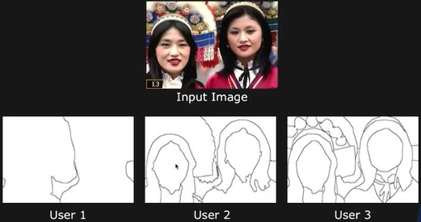
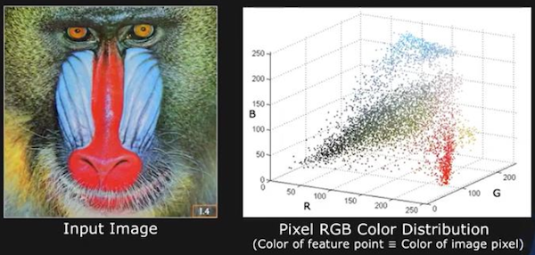
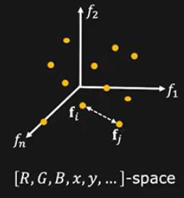
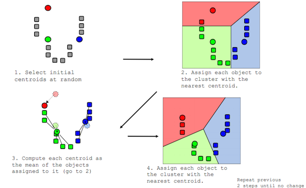
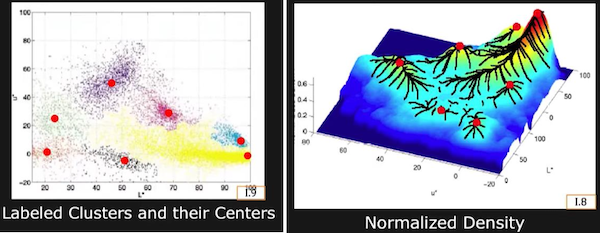
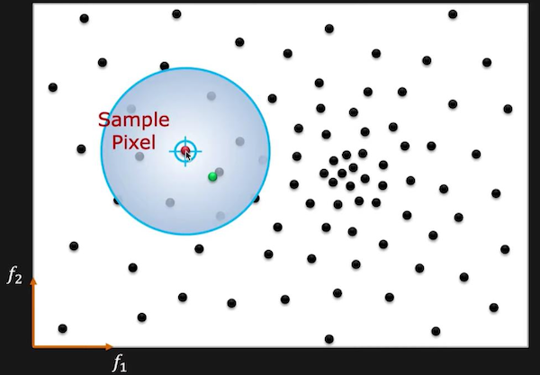
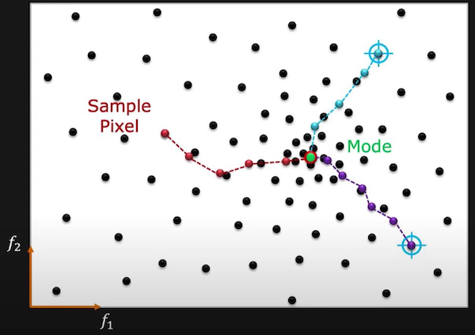

## 4.4 영역 분할

**region segmentation**(영역 분할)은 물체가 점유한 영역에 집중해서 물체를 분할하는 방법이다. 이러한 점은 사람이 영역을 분할하는 접근법에 가깝다.

- 사람은 뇌에서 물체의 3차원 모델을 꺼내서 파악한 뒤, 경우에 따라서 더 세밀한 부분까지 파악하는 방식으로 물체를 인식한다.

  > 사람은 전체적인 모양을 먼저 보고(이것은 사람이고, 이것은 늑대네?), 그 다음 세부적인 요소(입과 코를 보았을 때 화가 났네?)를 본다. 이처럼 의미 있는 단위로 분할하는 방식으로 **sementic segmentation**(의미 분할)이라 한다.

그런데 segmentation/grouping을 위해서는 이를 위한 기준이 있어야 한다. 아래는 몇 가지 예시다.

- proximity principle: 가까운 물체끼리

- similiarity principle: 모양이나 색깔 등이 비슷한 물체끼리

- common fate: 같은 움직임이나 변화를 보이는 물체끼리

- continuity principle: 연속적으로 배치된 물체끼리(예를 들어 실제로 선은 없지만 수직선처럼 배치된 물체끼리)

- symmetry principle: 대칭적으로 배치된 물체끼리

- illusory contours: 실제로는 없지만 특정한 모양으로 보이는 물체끼리

---

### 4.4.1 배경이 단순한 영상의 영역 분할

---

### 4.4.2 픽셀 분할

혹은 픽셀의 특성을 이용하여 영역을 분할할 수 있다.

> brightness, color, position, depth, motion, texture, material, ...

> 또한 픽셀을 이용한 분할에서도 접근법에 따라서 'top-down segmentation', 'bottom-up segmentation'으로 나눌 수 있다.

어느 이미지를 Euclidean space에 표현한 예시를 보자.

> RGB 도메인에 픽셀을 옮겨서 feature vector로 표현한다.

픽셀을 feature vector로 나타낼 수 있다.(color, location, depth, ...)

$$ [R, G, B, x, y, d, ...] $$

기하학적으로 두 벡터 사이의 Euclidean distance를 측정하는 **L2 Distance**를 적용하여 픽셀의 유사도를 측정할 수 있다.(<U>L2 Distance가 작을수록 유사도가 높다.</U>)

- $f_i$ , $f_j$  L2 Distance: 각 픽셀별 차이를 제곱한 값을 모두 합산한 뒤 루트를 씌운다.

$$ S(f_i, f_j) = \sqrt{{\sum}_{k}{(f_{ik} - f_{jk})}^{2}} $$

---

#### 4.4.2.1 K-Means Clustering

**K-means clustering**(K-평균 알고리즘)은 **centroids**(기준점) 몇 개를 무작위하게 생성한 뒤, 데이터를 군집화하는 방식의 알고리즘이다.

> 1957년 소개된 개념으로, K-Means clustering으로 불리게 된 건 1967년부터이다.

pixel feature을 3개의 cluster로 분할하는 3-Means clustering 예시를 통해 살펴보자. 

1. 무작위로 initial centroids 3개를 생성한다.

2. 각 픽셀 $\mathrm{x_{j}}$ 을 가장 가까운 centroid { $m_1, m_2, m_3$ } 에 할당한다. 

3. 각 cluster에 할당된 데이터 값의 평균치(mean)를 구한다.

4. centroid를 해당 평균치에 해당되는 위치로 옮긴 뒤, 수렴(convergence)까지 2번부터의 과정을 다시 반복한다.

  - threshold $\epsilon$ 값보다 작아지면 수렴한 것으로 간주한다.

> centroids를 means로 표기하기도 한다. (기호로 $m$ 을 쓴 이유)

$k$ 개 initial centroids를 고르는 방법은 다양하게 있으나, 대표적으로 세 가지를 뽑으면 다음과 같다.

- random feature points를 뽑는 대신, 두 feature points가 가까우면 resampling한다.

- 균등한 간격으로 feature points를 뽑는다.

- pixel의 부분집합에서 k-means clustering을 수행한 뒤, 그 결과를 initial centroids로 사용한다.

---

#### 4.4.2.2 K-Means Clustering 장단점

> [위키백과: K-평균 알고리즘](https://ko.wikipedia.org/wiki/K-%ED%8F%89%EA%B7%A0_%EC%95%8C%EA%B3%A0%EB%A6%AC%EC%A6%98)

장점

- 알고리즘이 단순하고 (reasonably) 빠르다.

단점

- cluster 수 $k$ 를 적당한 값으로 정해야 한다.

  - $k$ 값에 따라 clustering 결과가 완전히 달라진다.

- initialization에 민감하다.

  - 초기값을 잘못 주면 **global optimum**(전역 최적값)이 아닌 **local optimum**(지역 최적값)을 도출할 가능성이 있다.

- outlier에 민감하다.

---

#### 4.4.2.3 Mean Shift

clustering-based segmentation에서는 cluster를 정해야 한다. **Mean Shift**란 데이터의 분포를 바탕으로 cluster를 정하는 방법이다.

- hill: cluster

- hill peak(mode): centroid

- 각 픽셀은 (가장 데이터가 밀집되어 있는) 가장 가파른 centroid를 향해 이동한다.

  - search radius(**window**) 내 존재하는 데이터를 바탕으로 이동할 위치를 계산한다.

    > 계산은 simple means 혹은 weighted means로 수행한다.

---

#### 4.4.2.4 Mean Shift 장단점

장점

- 알고리즘이 단순하다.

- initialization이 필요하지 않다.

- outlier에 robust하다.

단점

- computationally expensive

- 임의의(arbitrary) cluster 수를 정해야 한다.

- window size $W$ 를 어떻게 설정하는가에 따라 clustering 결과가 달라진다.

---
