# 10 동적 비전

> [CS231M Mobile Computer Vision Lecture 7: Optical flow and tracking](https://web.stanford.edu/class/cs231m/lectures/lecture-7-optical-flow.pdf)

사람의 시각은 '움직임'을 매 순간 파악할 수 있는 동적 비전이다.

- **video**(비디오)는 시간 순서에 따라 정지 영상을 나열한 구조다. 이를 **dynamic image**(동영상)이라고 부른다.

- 비디오를 구성하는 영상 한 장을 **frame**(프레임)이라고 부른다.

- 비디오는 2차원 frame에 시간 축이 추가되었으므로, **spatio-temporal**(시공간) 데이터이다.

  > 컬러 영상일 경우 channel이 3장이므로 4차원 구조 텐서가 된다.

---

## 10.1 모션 분석

초기 비디오 분석에서는 camera, light, background 조건을 고정한 단순한 환경을 가정했다. 

- 배경이 고정된 상황에서는 **difference image**(차영상)을 분석해서 정보를 얻어내면 된다.

이러한 환경의 예시로 '공장의 컨베이어 벨트 위를 지나가는 물체의 위치와 속도'를 알아낸다고 하자.

$$ d(j, i, t) = |f(j, i, 0) - f(j, i, t)| $$

- $0 \le j < m$ , $0 \le i < n$ , $1\le t \le T$

- pixel: $(j, i)$ , time: $t$

이후로 일반적인 비디오 연구로 넘어가게 되면서, 초창기는 **optical flow**(광류)를 활용하는 접근법이 주류가 되었다.

> [Coherence](https://searching-fundamental.tistory.com/15): optical flow를 활용하게 되는 insight

> **image coherence**: 이미지의 특정 부분에서는 높은 확률로 인접 픽셀도 유사한 값을 갖는다.

> **time coherence**: 동영상의 시간 $t$ 와 바로 다음 순간 $t+1$ 의 픽셀 값은 높은 확률로 유사하다.(<U>같은 경우는 움직임이 없었다고 추측할 수 있다.</U>)

---

### 10.1.1 motion vector와 optical flow

> [옵티컬 플로우 (Optical Flow) 알아보기](https://gaussian37.github.io/vision-concept-optical_flow/)

> [Optical flow and scene flow estimation: A survey(June 2021)](https://ui.adsabs.harvard.edu/abs/2021PatRe.11407861Z/abstract)

동영상 속 움직이는 물체는 연속 프레임에서 **명암 변화**(brightness pattern)를 일으키게 된다. 

- 따라서 명암 분석을 통해 물체의 motion information을 추정(approximation)할 수 있다.( <U>어디까지나 추정</U>. optical flow $\neq$ motion field )

- pixel별 **motion vector**(모션 벡터)를 추정해 기록한 map을 **optical flow**(광류)라고 한다.

하지만 실제 motion은 3차원에 일어나는 일이지만, 3차원 공간의 무수히 많은 벡터를 2차원 공간으로 투영하면서 정보 손실이 일어난다. 대표적으로 구체 회전(spinning sphere)과 광원 회전(moving light source)의 예시를 들 수 있다.

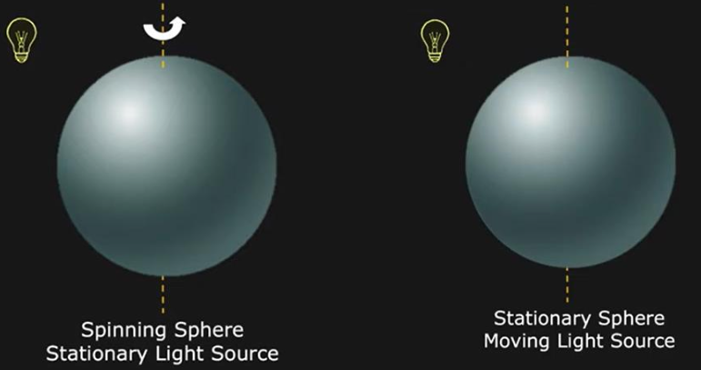

대표적인 예시 하나를 더 보자.

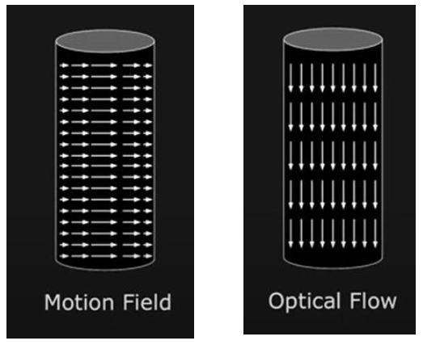

또한 동영상 속 물체는 '이동, 회전, 크기 변환'을 일으키며, '조명 변화, 잡음'과 같은 환경 요소에 의해 영향을 받기 때문에 motion vector를 추정하기는 쉽지 않다. 

따라서 이러한 어려움 때문에 motion vector를 추정하는 알고리즘에서는 두 가지 가정을 한다.

- **brightness constancy**(밝기 항상성): 연속한 프레임에서 같은 물체는 같은 명암으로 나타난다.

- 두 영상의 변위(displacement $dx, dy$ )와 시간 차이(time step $dt$ )가 충분히 작다.

  - 이 경우 테일러 급수에 따라 특정 식이 성립한다.

  - 예: 초당 30프레임일 경우( $dt = 1/30$ ), 충분히 작은 시간에 해당된다.

$$ f(y + dy, x+ dx , t + dt) = f(y, x, t) + {{\partial f} \over {\partial y}}dy + {{\partial f} \over {\partial x}}dx + {{\partial f} \over {\partial t}}dt + O(dx^2) $$

1. 위 식에서 $dt$ 가 작다는 가정: 2차 이상( $O(dx^2)$ )을 무시할 수 있다.(almost zero)

2. 밝기 항상성 가정에 따라 $dt$ 동안 $(dy, dx)$ 만큼 이동하여 형성된 $f(y + dy, x+ dx, t + dt)$ 는 $f(y, x, t)$ 와 같다.

따라서 식은 다음과 같이 바꿔쓸 수 있다.

$$ {{\partial f} \over {\partial y}}{dy \over dt} + {{\partial f} \over {\partial x}}{dx \over dt} + {{\partial f} \over {\partial t}}  = 0$$

여기서 $dy/dt$ , $dx/dt$ 가 바로 이동한 양에 해당되는 **optical flow** $(v, u)$ 이다.

$$ {{\partial f} \over {\partial y}}v + {{\partial f} \over {\partial x}}u + {{\partial f} \over {\partial t}}  = 0$$

이를 **optical flow constraint equation**(광류 방정식)이라고 한다.

### &nbsp;&nbsp;&nbsp;📝 예제 1: optical flow constraint equation 계산&nbsp;&nbsp;&nbsp;

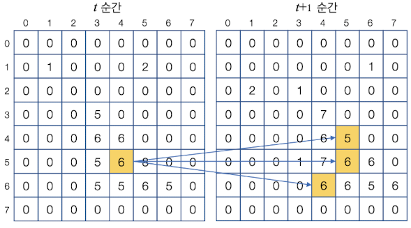

광류 방정식을 다음과 같이 표기할 때, 두 프레임 사이에서 $(I_{x}, I_{y}, I_{t})$ 를 구하시오.

$$ I_{x}u + I_{y}v + I_{t} = 0 $$

이번 예제에서는 $I_{x}, I_{y}$ 는 계산 편의상 바로 이웃에 있는 화소와 명암 차이로 계산한다.

- $I_{x} = f(y, x+1, t) - f(y, x, t)$

- $I_{y} = f(y+1, x, t) - f(y, x, t)$

- $I_{t} = f(y, x, t+1) - f(y, x, t)$

### &nbsp;&nbsp;&nbsp;🔍 풀이&nbsp;&nbsp;&nbsp;

- $I_{x} = f(5, 5, t) - f(5, 4, t) = 2$

- $I_{y} = f(6, 4, t) - f(5, 4, t) = -1$

- $I_{t} = f(5, 4, t+1) - f(5, 4, t) = 1$

이를 식에 대입하면 다음과 같다.

$$ 2u -v + 1 = 0 $$

그런데 변수는 두 개가 있으므로 해를 구하려면 방정식이 더 필요하다.

---

#### 10.1.1.1 constraint line과 optical flow

예제 1을 통해 알 수 있듯이, 광류 방정식(optical flow constraint equation)은 유일한 해 하나를 결정할 수 없고, 단지 optical flow $\mathrm{u} = (v, u)$ 가 만족해야 하는 조건식만을 얻는다.

이를 **constraint line** 이라고 하는데, constraint line에 위치한 optical flow $\mathrm{u}$ 를 두 가지 components로 나누면 **normal flow**를 구할 수 있다.

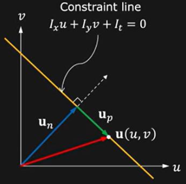

$$ \mathrm{u} = \mathrm{u_{n}} + \mathrm{u_{p}} $$

- $\mathrm{u_{n}}$ : constraint line에 수직인 성분(normal flow)

- $\mathrm{u_{p}}$ : constraint line에 평행한 성분(parallel flow)

normal flow의 direction과 magnitude를 구해보자. constraint line과 수직하기 때문에 다음 식을 통해 구할 수 있다.

- direction

$$ \hat{\mathrm{u_{n}}} = {{(I_{x}, I_{y})} \over {\sqrt{{I_{x}}^{2}+{I_{y}}^{2}}}} $$

- magnitude

$$ |\mathrm{u_{n}}| = {{|I_{t}|} \over {({I_{x}}^{2}+{I_{y}}^{2})}}(I_{x}, I_{y}) $$

하지만 parallel flow의 경우 constraint line에 평행하기 때문에 구할 수 없다.

---

#### 10.1.1.2 Lucas-Kanade Solution

앞서 광류 방정식이 유일한 해를 확정하지 못했다. 하지만 **Lukas-Kanade Solution**(1981)은 영상이 아주 많은 pixel로 구성된다는 점을 이용해, 이웃 pixel간의 관계를 활용하여 광류 방정식의 상당히 정확한 해를 구한다.

Lukas-Kanade Solution은 다음과 같은 가정을 한다.

- 특정 pixel은 small window $W$ 내 neighborhood pixel과 유사한 optical flow $(u, v)$ 를 갖는다.

  > 지역 조건(local condition)이라고 한다.

    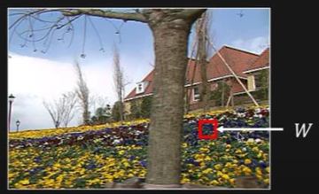

    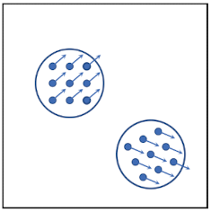

이 가정에 따라서 다음 공식이 성립한다.

- 모든 점 $(k, l) \in W$ 에서 다음 방정식이 성립한다.

$$ I_{x}(k, l)u + I_{y}(k, l)v + I_{t}(k, l) = 0 $$

window의 크기를 $n \times n$ 으로 두면 $n^{2}$ 개의 방정식이 생기게 된다. 이를 행렬로 나타내면 다음과 같다.

$$ \begin{bmatrix} I_{x}(1,1) & I_{y}(1,1) \\ I_{x}(k,l) & I_{y}(k,l) \\ I_{x}(n,n) & I_{y}(n,n) \end{bmatrix} \begin{bmatrix} u \\ v \end{bmatrix} = \begin{bmatrix} I_{t}(1,1) \\ I_{u}(k, l) \\ \vdots \\ I_{t}(n, n) \end{bmatrix} $$

각 행렬을 간단하게 $A \mathrm{u} = B$ 라고 하자.

- $A$ : $n^{2} \times 2$ 행렬

- $\mathrm{u}$ : $2 \times 1$ 행렬

- $B$ : $n^{2} \times 1$ 행렬

여기서 Least-Squares Solution를 통해 $\mathrm{u}$ 를 구해보자.

$$ A \mathrm{u} = B $$

$$ A^{T}A \mathrm{u} = A^{T}B $$

> Least-Squares using pseudo-inverse

$$ \mathrm{u} = (A^{T}A)^{-1}A^{T}B $$

이러한 풀이를 위해서는 두 가지 가정이 필요하다.

- $A^{T}A$ 는 invertible하다. ( 즉, $\det (A^{T}A) \neq 0$ )

- $A^{T}A$ 는 well-conditioned하다.

   - ${\lambda}_{1}$ 과 ${\lambda}_{2}$ 가 $A^{T}A$ 의 eigen value라고 하면 다음 두 조건을 만족한다.

   - ${\lambda}_{1} > \epsilon$ and ${\lambda}_{2} > \epsilon$

   - ${\lambda}_{1} \ge {\lambda}_{2}$ but not ${\lambda}_{1} >>> {\lambda}_{2}$

다음과 같은 textured region을 보면 위 조건을 잘 만족(well-conditioned)하는 것을 알 수 있다.

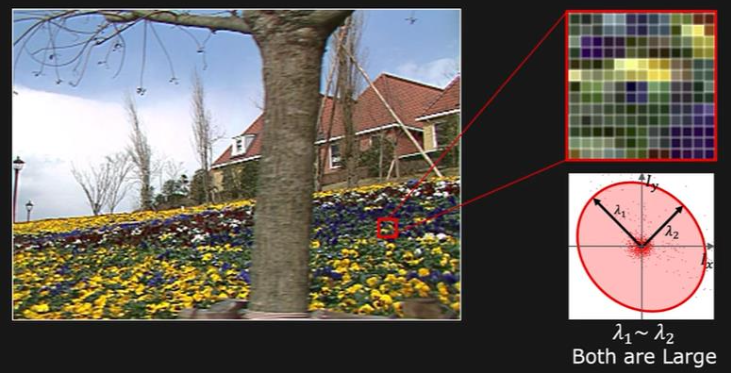

문제는 이러한 가정을 만족하지 못하는 조건이 있다.

- smooth region

  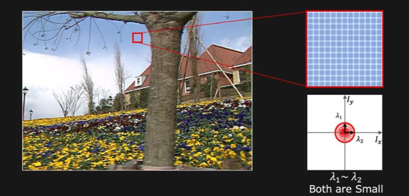

- edge

  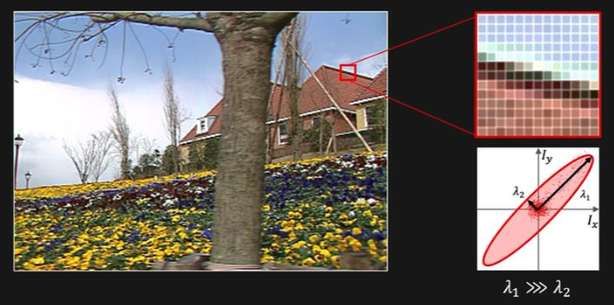

---

#### 10.1.1.3 aperture problem

하지만 Lucas-Kanade Solution은 좁은 window에서 연산을 하기 때문에, window보다 큰 움직임이 발생한다면 이를 계산하지 못한다.(**aliasing**이 발생한다.)

또한 **aperture problem** 문제를 해결하지 못한다. 아래는 aperture problem의 예시이다.

> aperture란 작은 구멍을 의미한다.

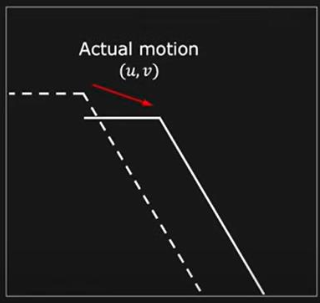

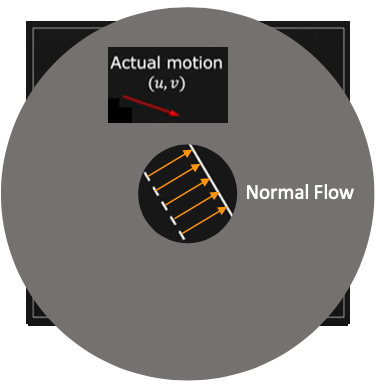

---
