# 11 Vision transformer

- Transformer 원리와 전개 과정이 잘 정리된 서베이 논문

    > [A survey of Transformers](https://arxiv.org/abs/2106.04554)

    > [Efficient Transformers: A Survey](https://arxiv.org/abs/2009.06732)

- Transformer에 CV를 적용한 서베이 논문

    > [Transformers in Vision: A Survey](https://arxiv.org/abs/2101.01169)

    > [A Survey on Vision Transformer](https://arxiv.org/abs/2012.12556)

---

- 사람은 영상을 인식할 때 intention(의도)에 따라 특정 포인트를 **attention**(주목)한다.

- **VQA**(Visual Question Answering): 영상과 관련된 질문에 답을 하는 Computer Vision

  - 이를 위해서는 사람의 attention과 같은 능력을 갖춰야 한다.

    > 최근 attention mechanism만으로 구성된 transformer model이 CNN 성능을 뛰어넘는다.

---

### 11.1.1 고전 알고리즘: feature selection

> [image recognization 문제에서의 주요 해석 방법](https://www.cognex.com/ko-kr/blogs/deep-learning/research/overview-interpretable-machine-learning-2-interpreting-deep-learning-models-image-recognition)

attention을 제대로 알아보기 전에 먼저 **feature selection**(특징 선택)을 먼저 살펴보자. attention의 일종은 아니지만 마찬가지로 도움이 되는 특징만 골라서 사용한다는 점은 같다.

- 쓸모가 많은 feature(특징)은 남긴다.

- 나머지는 제거한다.

4가지 feature( $x_1, x_2, x_3, x_4$ )가 있는 예시를 살펴보자.

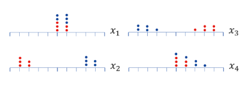

> 빨간색: 불량 / 파란색: 정상

가령 위 예시에서 feature 2개만 선택한다면(: 1), 분별력이 강한 $x_{2}, x_{3}$ 을 취할 것이다.(선택하지 않음: 0)

---

### 11.1.2 고전 알고리즘: saliency map

**saliency map**(돌출 맵)은 attention해야 하는 정도를 실수로 표현하는 방법이다. pixel 값의 변화가 급격한 부분을 모아서 mapping한 뒤 배경과 분리한다.

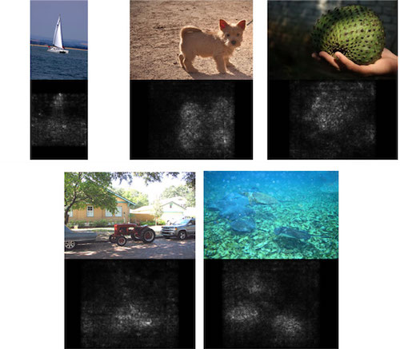

---

### 11.1.3 딥러닝의 attention

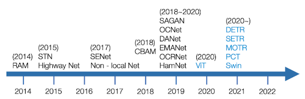

- RAM(Recurrent Attention Model): 2014년 발표. RNN을 이용해 딥러닝에서 최초로 attention을 적용한 모델

- STN(Spatial Transformer Network): 2015년 발표. feature map에 affine(translation, scaling, rotation) transform을 적용해서 attention할 곳을 정하는 모델

  - 변환 행렬을 학습으로 알아낸다.

- SENet(Squeeze-and-Excite Network): 2017년 발표. feature map의 어느 channel에 attention할지 알아낸다.

    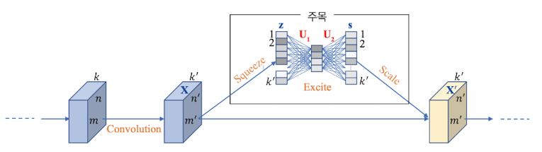

  > [SENet 정리: #7.2.8 SENet: Squeeze-and-Excitation block](https://github.com/erectbranch/TinyML_and_Efficient_DLC/tree/master/lec07/summary01)

---

### 11.1.4 딥러닝의 attention: self-attention

이전까지는 '중요한 부분에 더 큰 가중치를 줘서 성능을 개선'했다.

- 중요한 곳은 큰 가중치를 주고, 중요하지 않은 곳은 작은 가중치를 준다.

하지만 **self-attention**(자기 주목)은 영상을 구성하는 요소 상호 간의 관계를 찾아낸다.

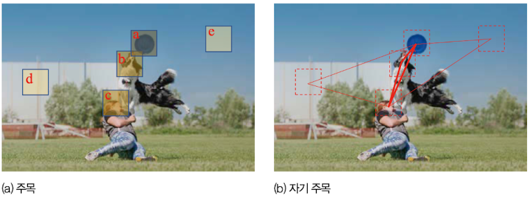

self-attention은 프리스비가 다른 위치에 attention하는 정도를 선의 굵기로 표현한다.

- 프리스비를 잡으려는 개에 많이 attention한다.

- 하늘에는 별로 attention하지 않는다.

> 참고로 2018년 [Non-local Neural Network](https://arxiv.org/abs/1711.07971)에서 CV에 처음 self-attention이 적용되었다. 아래 식을 통해 self-attention을 계산한다.

$$ y_{i} = {{1} \over {C(\mathbf{x})}}{\sum}_{j}{a(\mathbf{x_{i}}, \mathbf{x_{j}})g(\mathbf{x_{j}})} $$

---

## 11.2 RNN

**RNN**(Recurrent Neural Network, 순환 신경망)은 hidden node끼리 edge를 이어서 순환 구조를 만든다.

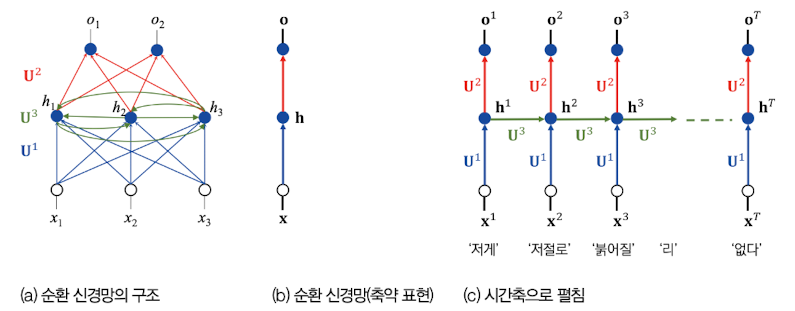

- weight 집합: $\{U^{1}, U^{2}, U^{3}\}$ 

  - $U^{1}$ : input layer ~ **hidden layer**

  - $U^{2}$ : **hidden layer** ~ output layer

  - $U^{3}$ : **hidden layer** ~ **hidden layer**

이제 문장을 표현한 벡터 $\mathbf{o=(x^{1}, x^{2}, x^{3} , \cdots , x^{T})}$ 를 입력으로 받는다고 하자. 길이는 $T$ 이며, $i$ time의 단어 $x^{i}$ 는 벡터다.

> 예를 들어 '저게 / 저절로 / 붉어질 / 리 / 없다'는 문장은 $T=5$ 이다. embedding되어 벡터로 입력이 들어간다.

위 구조 그림에서 '(c) 시간축으로 펼침' 부분을 보자.

- $\mathbf{x}^{3}, \mathbf{h}^{2}$ 가 입력되어 $\mathbf{h}^{3}$ 이 생성된다. 출력으로 $\mathbf{o}^{3}$ 이 나온다.

- 일반화: $\mathbf{x}^{i}, \mathbf{h}^{i-1}$ 이 입력되어 $\mathbf{h}^{i}$ 가 생성된다. 출력으로 $\mathbf{o}^{i}$ 가 나온다.

일반화는 time $i$ d에서 출력이 나오기까지의 동작을 정의한 것이다. 좀 더 자세히 살펴보자.

- 입력 $\mathbf{x}^i$ 에 weight $\mathbf{U}^1$ 을 곱한 결과와, 입력 $\mathbf{h}^{i-1}$ 에 $\mathbf{U}^3$ 을 곱한 결과를 더해서, time $i$ 의 hidden vector $\mathbf{h}^{i}$ 를 만든다.

$$ \mathbf{h}^i = {\tau}_{1}(\mathbf{U}^3 \mathbf{h}^{i-1} + \mathbf{U}^1 \mathbf{x}^i) $$

- $\mathbf{h}^{i}$ 에 $\mathbf{U}^2$ 를 곱하고 activation function ${\tau}_{2}$ 를 곱해서, output $\mathbf{o}^i$ 를 출력한다.

$$ \mathbf{o}^i = {\tau}_{2}(\mathbf{U}^2 \mathbf{h}^i) $$

이처럼 순차적으로 연산이 진행되고, 지난 hidden state로 다음 hidden state를 만들기 때문에 계속 이전 정보와 상호작용하게 된다. 예를 들어 세 번째 단어라면 첫 번째 단어와 두 번째 단어에 대한 정보와 상호작용한다.

---

### 11.2.1 LSTM

기존 RNN은 $1, 2, ..., i$ 로 가며 오래된 단어의 정보가 희미해지는데, 종종 앞쪽 단어와 멀리 뒤에 있는 단어가 밀접하게 상호작용해야 하는 경우가 있다.(**long-range dependency**)

**LSTM**(Long Short-Term Memory, 장단기 메모리)는 RNN의 한 종류로, 곳곳에 input, output을 열거나 막을 수 있는 gate를 두어서 선별적으로 기억하는 기능을 확보한 모델이다.

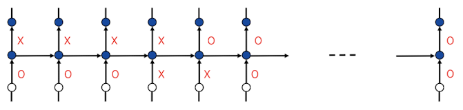

- 여닫는 정도는 학습으로 알아낸 weight에 따라 결정된다.

---

### 11.2.2 seq2seq

seq2seq는 2014년 자연어 처리 분야에서 발표된 획기적인 모델이다. 

- 가변 길이 문장을 또 다른 가변 길이 문장으로 변환할 수 있다.

   > 예를 들어 문장 번역 시 seq2seq를 이용해서, 길이가 다른 목표 언어의 문장을 생성할 수 있다.

encoder, decoder로 구성된 seq2seq 모델의 학습 단계, 추론 단계 동작 방식을 살펴보자.

1. 우선 학습 단계는 decoder의 input, output이 모두 동작한다.

    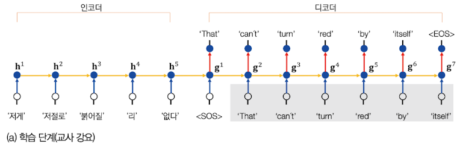

    - 다시 말해 정답 문장을 decoder의 input으로 알려주는 **teacher forcing**(교사 강요) 방식을 사용한다.

<br/>

2. 추론(예측) 단계에서는 decoder의 input을 빼고, **auto-regressive**(자기 회귀) 방식으로 동작한다.

    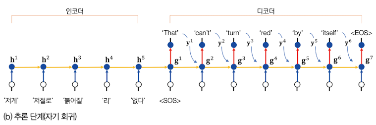

    - 다시 말해 decoder의 output을 다음 input으로 사용한다.

        > time 1에서 \<SOS\>가 입력되면, 첫 단어 'That'을 출력하고, 출력 'That'을 다시 입력으로 사용해서 time 2에서 'can't'를 출력한다. 이런 식으로 \<EOS\>가 출력될 때까지 반복한다.

auto-regressive 방식을 식으로 표현하면 다음과 같다.

$$ \mathbf{g}^{i} = {\tau}_{i} (\mathbf{U}^{3}\mathbf{g}^{i-1} + \mathbf{U}^{1}\mathbf{y}^{i-1}) $$

$$ \mathbf{o}^{i} = {\tau}_{2}(\mathbf{U}^{2}\mathbf{g}^{i}) $$

그런데 이러한 seq2seq도 한계를 가진다. 제일 큰 문제는 **encoder의 마지막 hidden state만 decoder로 전달된다**는 점이다.

- 따라서 encoder는 마지막 hidden state에 모든 정보를 압축해야 한다.

- decoder는 encoder의 모든 순간에 있는 풍부한 정보를 활용할 수 없다.

---

### 11.2.3 query-key-value

seq2seq의 한계를 극복하기 위한 한 방법으로, **query-key-value**으로 attention을 적용한 연구가 있다. 우선 query, key, value가 무엇인지 개념부터 알아보자. 

> key와 value는 Python의 딕셔너리 자료형을 생각해 보면 쉽게 이해할 수 있다.

```Python
dict = {"2017": "Transformer", "2018": "BERT"}
```

attention은 다음 과정으로 진행된다.

- attention function은 주어진 query를 가지고 모든 key에서 유사도를 구한다. 그 다음 유사도를 각 key의 value에 반영한다.

  - 다시 말해 유사도를 가중치로 사용해서 value에 가중하는 방식으로 진행되는 것이다.

    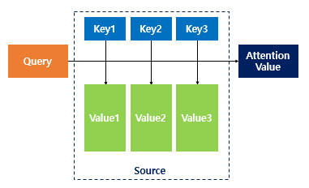

- 유사도가 반영된 value를 모두 더한 후 반환된 값을 **attention value**라고 한다. = $Attention(\mathbf{q}, \mathbf{K}, \mathbf{V})$ 

실제 예시를 바탕으로 살펴보자.

### <span style='background-color: #393E46; color: #F7F7F7'>&nbsp;&nbsp;&nbsp;📝 예제 1: query-key-value를 이용한 attention 계산&nbsp;&nbsp;&nbsp;</span>

유사도 $s_{i}$ 는 inner product $\mathbf{q} {\mathbf{k}_{i}}^{T}$ 방식으로 산정한다고 가정한다.

- query $\mathbf{q}$ = (0.990, 0.099, 0.099)

- key, value는 4개: $k_{1}, \cdots k_{4}$ , $v_{1}, \cdots , v_{4}$

$$ \mathbf{K} = \begin{bmatrix} 0.050 & 0.000 & 0.998 \\ 0.020 & 0.020 & 0.999 \\ 0.976 & 0.098 & 0.195 \\ 0.020 & 0.999 & 0.020 \end{bmatrix} $$

$$ \mathbf{V} = \begin{bmatrix} 1 & 2 & 5 \\ 1 & 1 & 5 \\ 3 & 2 & 4 \\ 6 & 1 & 2 \end{bmatrix} $$

### <span style='background-color: #C2B2B2; color: #F7F7F7'>&nbsp;&nbsp;&nbsp;🔍 풀이&nbsp;&nbsp;&nbsp;</span>

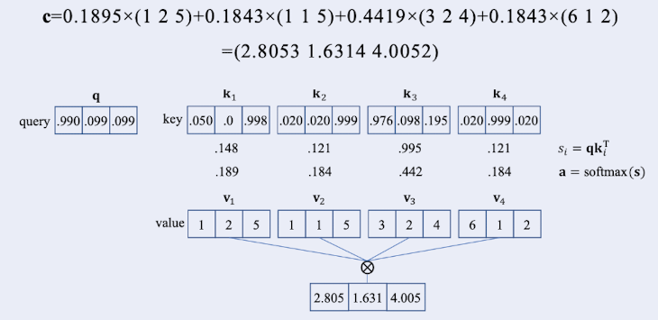

우선 **attention vector** $\mathbf{a}$ 를 구하자. 유사도 벡터를 계산한 뒤 softmax를 적용한 것이다.

$$ \mathbf{a} = \mathrm{softmax}(\mathbf{q}{\mathbf{K}}^{T}) = \mathrm{softmax} \left( \begin{bmatrix} 0.990 & 0.099 & 0.099 \end{bmatrix} \begin{bmatrix} 0.050 & 0.020 & 0.976 & 0.020 \\ 0.000 & 0.020 & 0.098 & 0.999 \\ 0.998 & 0.999 & 0.195 & 0.020 \end{bmatrix} \right) $$

$$ = \begin{bmatrix} 0.189 & 0.184 & 0.442 & 0.184 \end{bmatrix} $$

그 다음은 **contect vector** $\mathbf{c}$ 를 계산한다. attention vector와 value를 곱한 후 모두 합산한 값이다.

$$ \mathbf{c} = \mathrm{softmax}(\mathbf{q}{\mathbf{K}}^{T})\mathbf{V} = \begin{bmatrix} 0.189 & 0.184 & 0.442 & 0.184 \end{bmatrix} \begin{bmatrix} 1 & 2 & 5 \\ 1 & 1 & 5 \\ 3 & 2 & 4 \\ 6 & 1 & 2 \end{bmatrix} $$

$$ = \begin{bmatrix} 2.805 & 1.631 & 4.005 \end{bmatrix} $$

---

### 11.2.4 attention을 반영한 seq2seq 모델

지난 그림을 다시 살펴보자.


- 예를 들어 time 6에서 decoder는 '저절로'에 주목해야 'itself'를 제대로 출력할 수 있다.

- 그렇다면 $\begin{bmatrix} 0.01 & 0.9 & 0.02 & 0.03 & 0.04 \end{bmatrix}$ 처럼 두 번째 요소('저절로') 값이 큰 attention vector $\mathbf{a}$ 를 생성하면, decoder는 '저절로'에 주목할 수 있게 된다.

이제 이러한 상황에서 query-key-value로 무엇을 사용할지 정해 보자.

- time 6는 time 5에서 ${\mathbf{g}}^{5}$ 를 받는다. 이것을 query로 활용할 것이다.

  - 예시로 ${\mathbf{g}}^{5}$ 를 다음과 같이 가정한다.

$$\mathbf{q} = \begin{bmatrix} 0.2 & 0.9 & 0.0 \end{bmatrix}$$

- key, value는 어떤 값을 사용할까? 바로 ${\mathbf{h}}^{1}, {\mathbf{h}}^{2}, \cdots , {\mathbf{h}}^{5}$ 를 사용한다.

   - 예시로 ${\mathbf{h}}^{1}, {\mathbf{h}}^{2}, \cdots , {\mathbf{h}}^{5}$ 를 다음과 같이 가정한다.

$$ \mathbf{K} = \begin{bmatrix} 0.1 & 0.0 & 0.8 \\ 0.1 & 0.9 & 0.0 \\ 0.0 & 0.1 & 0.8 \\ 0.2 & 0.1 & 0.6 \\ 0.9 & 0.0 & 0.1 \end{bmatrix} $$

$$ \mathbf{V} = \begin{bmatrix} 0.1 & 0.0 & 0.8 \\ 0.1 & 0.9 & 0.0 \\ 0.0 & 0.1 & 0.8 \\ 0.2 & 0.1 & 0.6 \\ 0.9 & 0.0 & 0.1 \end{bmatrix} $$

지난 유사도를 구한 뒤 softmax를 적용하여 attention vector를 구한다. 그리고 이를 value와 곱한 후 모두 합산하면 contect vector $\mathbf{c} = \begin{bmatrix} 0.243 & 0.339 & 0.370 \end{bmatrix}$ 을 얻을 수 있다.

이렇게 구해낸 contect vector는 decoder의 입력 항의 한 자리를 차지하게 된다. 가중치 ${\mathbf{U}}^{4}$ 를 곱한 뒤 추가되며, 이 가중치는 학습을 통해서 추가로 알아내야 한다.

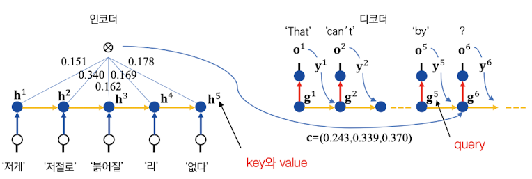

$$ {\mathbf{g}}^{i} = {\tau}_{1}({\mathbf{U}}^{3}{\mathbf{g}}^{i-1} + {\mathbf{U}}^{1}{\mathbf{y}}^{i-1} + {\mathbf{U}}^{4}{\mathbf{c}}^{i}) $$


$$ {\mathbf{o}}^{i} = {\tau}_{2}({\mathbf{U}}^{2}{\mathbf{g}}^{i}) $$

---