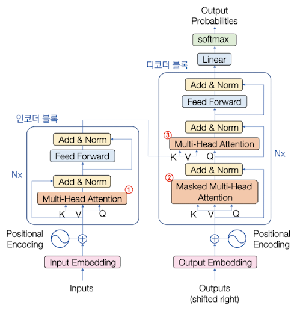
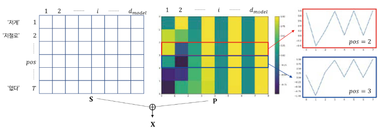
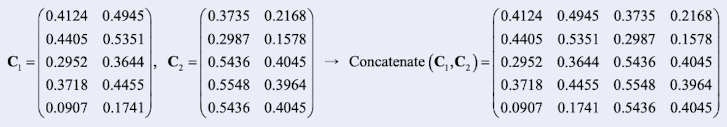
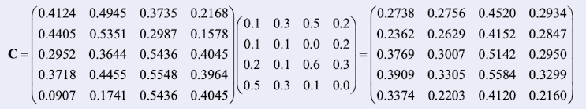
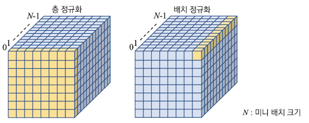
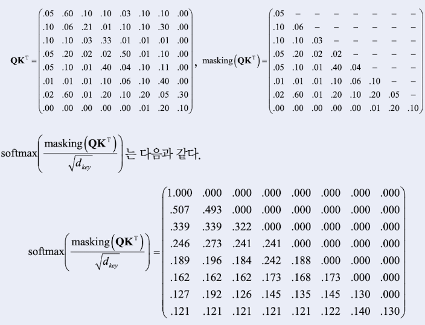
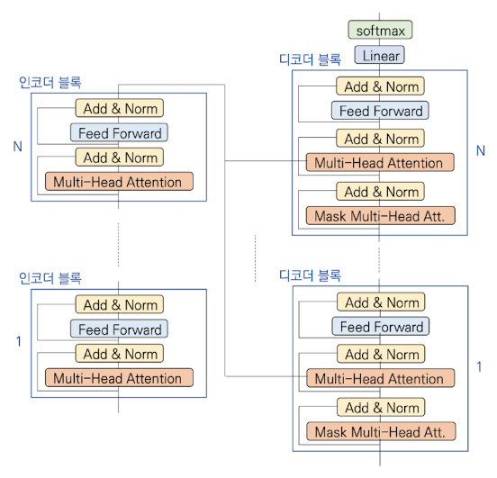

## 11.3 Transformer

2017년 Google 연구진의 [Attention is all you need](https://arxiv.org/abs/1706.03762)라는 논문에서 Transformer 모델이 발표되었다.

Transformer는 RNN과 CNN의 구성요소를 없애고, 오직 attention만으로 신경망을 구현했다.

---

### 11.3.1 기본 구조

Transformer는 encoder, decoder로 구성된다.

> 한국어를 영어로 번역하도록 학습한다면, encoder에는 한국어 문장이 입력되고 decoder에는 영어 문장이 입력된다.



> block 옆 Nx 표시는, block이 N개 연결되어 있다는 뜻이다.

- Inputs: RNN의 순차적으로 입력하는 구조가 사라졌다. **transformer는 모든 단어를 한꺼번에 입력**한다.

  - 단어는 word embedding을 통해 $d_{model}$ 차원의 embedding vector가 된다.

  - 단어의 위치 정보를 보완하기 위해, positional encoding(위치 인코딩)을 한 뒤 embedding vector에 더한다.

  > 이처럼 한꺼번에 입력하는 방식이 self-attention을 가능하게 만들며, 병렬 처리 면에서도 이점을 가져서 학습 시간이 줄어드는 효과가 있다.

- **MHA**(Multi-Head Attention): 주황색으로 표시된 layer

  - self-attention을 수행한다. 이름이 뜻하듯이 $h$ 개 head가 독립적으로 self attention을 수행한 뒤 결과를 concat한다.(여러 head를 사용하는 건 성능을 높이기 위함)

  - output은 **FF**(Feed Forward) layer의 input으로 전달된다.

- **FF**(Feed Forward): Fully-Connected layer이다.

- MHA, FF layer 모두 **Add&Norm**을 적용한다.

  - Add: skip connection을 의미한다.

  - Norm: layer normalization을 의미한다.

decoder도 encoder(Inputs)와 마찬가지로 word embedding, positional embedding으로 변환된 단어가 한꺼번에 입력된다. 2개의 MHA 층과 FF 층이 있으며 output layer는 softmax를 통해 확률 벡터를 출력한다.

attention의 핵심인 MHA층을 그림에서는 1번부터 3번까지 번호를 표시해 두었는데, 각각의 MHA층은 다음과 같은 역할을 한다.

1. (encoder) 입력 문장을 구성하는 단어 사이의 attention을 처리한다.

   - 같은 문장을 구성하는 단어 사이에서 attention을 수행하므로 **self-attention**이라고 한다.

2. (decoder) 출력 문장을 구성하는 단어 사이의 attention을 처리한다.(마찬가지의 이유로 **self-attention**)

   - time $i$ 에서 $1, 2, ..., i-1$ 까지의 단어에만 attention을 수행해야 하기 때문에, time $i+1, i+2, \cdots$ 단어는 mask로 감추어 진다. 이것이 Masked MHA라는 이름이 붙은 이유이다.

3. (decoder) encoder가 처리한 입력 문장과, decoder가 처리하고 있는 출력 문장 사이의 attention을 다룬다.(따라서 self-attention이 **아니다.**)

   - encoder의 context vector가 key-value, decoder의 상태가 query로 사용된다.

RNN은 encoder와 decoder 사이에만 attention이 적용되기 때문에 self-attention이 없었다. 하지만 transformer는 self-attention으로 더 높은 성능을 가질 수 있게 되었다. 이것이 바로 transformer의 핵심 아이디어다.

> 예를 들어 '영희가 파란색 신호등을 보고 길을 건너기 시작했는데 그게 금방 노란색으로 변했다'라는 문장이 있다고 하자.
 <U>self-attention을 통해 '그게'가 '신호등'을 attention하도록 하면</U> 제대로 번역될 가능성이 높아질 것이다.

---

### 11.3.2 Encoder의 동작

---

#### 11.3.2.1 word embedding, positional embedding

Encoder에서는 우선 입력 문장의 단어를 word embedding을 통해 $d_{model}$ 차원의 벡터로 변환했다.

- 단어가 $T$ 개 있다면, 문장(sentence)은 $T \times d_{model}$ 크기의 $\mathbf{S}$ 행렬로 표현할 수 있다.

그 다음 순서 정보의 손실을 보완하기 위해 positional encoding을 더했다.

- 동일한 크기의 위치 정보 행렬 $\mathbf{P}$ 를 얻은 뒤, $\mathbf{X} = \mathbf{S} + \mathbf{P}$ 행렬을 얻어낸다.(이것이 encoder의 입력이 된다.)

    

위치 행렬 $\mathbf{P}$ 는 주로 sin(짝수 위치), cos(홀수 위치) 함수를 이용한 식으로 만든다. 위 그림의 pos행을 예시로 식을 살펴보면 다음과 같다.(위 그림에서는 pos행=2행일 때, pos행=3행일 때를 그래프로 나타냈다.)

- 위치 행렬 $\mathbf{P}$ 의 짝수열( $2i$ )의 값은 $p_{pos,2i}$ 이다.

$$p_{pos,2i} = \sin \left( {{pos} \over {{10000}^{2i/d_{model}}}} \right)$$

- 위치 행렬 $\mathbf{P}$ 의 홀수열( $2i+1$ )의 값은 $p_{pos,2i+1}$ 이다.

$$p_{pos,2i+1} = \cos \left( {{pos} \over {{10000}^{2i/d_{model}}}} \right)$$

---

#### 11.3.2.2 self-attention

현재 encoder가 입력 문장에서 self-attention하는 과정이므로, query, key, value 모두 입력 문장을 표현한 단어 벡터 $\mathbf{X}$ 를 사용한다.

- 한꺼번에 $T$ 개 단어가 입력이 들어오는 만큼 $T$ 개 단어 각각이 query다.( $T$ 개 행을 갖는 행렬 $\mathbf{Q}$ 로 query를 표현 )

    > 다시 말해 기존 query-key-value에서는 query가 벡터 $\mathbf{q}$ 로 표현되었지만, transformer에서는 더 확장된 행렬 $\mathbf{Q}$ 로 표현된다.

    > 마찬가지로 attention vector도 attention matrix, context vector도 context matrix가 된다.

query-key-value를 통해 attention을 계산하는 과정을 행렬로 확장하여 다음과 같이 표현할 수 있다.

$$ \mathbf{C} = \mathrm{softmax}(\mathbf{Q}{\mathbf{K}}^{T})\mathbf{V} $$

encoder에서는 query, key, value 모두 입력 $\mathbf{X}$ 를 사용하는데, 바로 $\mathbf{Q}, \mathbf{K}, \mathbf{V}$ 대신 바로 넣지는 않고 각각의 가중치 행렬을 곱해서 사용한다. 또한 정규화 항 $\sqrt{d_{key}}$ 을 나눠주는 과정이 추가되었다.

$$ \mathbf{C} = \mathrm{softmax} \left({\mathbf{Q}{\mathbf{K}}^{T}} \over {\sqrt{d_{key}}} \right) \mathbf{V} $$

- 이때 $\mathbf{Q} = \mathbf{XW}^{Q}$ , $\mathbf{K} = \mathbf{XW}^{K}$ , $\mathbf{V} = \mathbf{XW}^{V}$

> 이러한 변환을 수행하는 가중치 행렬은 모두 학습으로 알아낸다.

위 식에서 다음 행렬의 의미를 더 생각해 보자.

$$ \mathrm{softmax} \left({\mathbf{Q}{\mathbf{K}}^{T}} \over {\sqrt{d_{key}}} \right) $$

- 행렬의 $i$ 번째 행: $i$ 번째 단어가 다른 단어에 attention할 정보를 제공한다.

---

#### 11.3.2.3 multi-head attention

MHA는 여러 개의 head를 가진다고 했다. 이러한 각 head는 고유한 변환 행렬 ${\mathbf{W_{i}^{Q}}}$ , ${\mathbf{W_{i}^{K}}}$ , ${\mathbf{W_{i}}^{V}}$ 를 가지고 self-attention을 독립적으로 수행하게 된다.

- 이후 각 head의 결과를 concate 최종 결과를 얻는다.

$$ \mathbf{C} = \mathrm{Concatenate}(C_{1}, C_{2}, \cdots , C_{h})W^{O} $$

- $W_{O}$ 행렬 역시 학습으로 알아낸다.

가령 $h=2$ (head가 2개)라고 가정하자. 각각 self-attention의 결과를 얻었다. 이 둘을 Concatenate한 결과는 다음과 같다.



$W_{O}$ 행렬을 $4 \times 4$ 크기로 가정하고 위 $\mathrm{Concatenate}({\mathbf{C_{1}}}$ , ${\mathbf{C_{2}}})$ 에 곱하면 최종 출력(output feature map) $\mathbf{C}$ 를 얻을 수 있다.



이렇게 얻어낸 output은 다음 layer인 Add&Norm layer를 통과하게 된다.

$$ \mathbf{X}' = \mathrm{Norm}(\mathbf{X} + \mathbf{C}) = \mathrm{Norm}(\mathbf{X} + \mathrm{MHA}(\mathbf{X})) $$

- Add(skip connection): output feature map $\mathbf{C}$ 와 원래의 input feature map $\mathbf{X}$ 를 더한다.

- Norm: 위 결과를 layer normalization(층 정규화)한다.

layer normalization이란 mini-batch를 구성하는 **sample별**로, feature map의 평균이 0, 표준 편차가 1이 되도록 정규화하는 방법이다. 아래 그림은 layer normalization과 batch normalization을 비교한 그림이다.

> batch는 1epoch당 사용하는 training dataset의 묶음. mini-batch란 전체 dataset을 N등분한 그룹에서, 각 그룹 내 또 다시 나눈 묶음을 의미한다.



---

#### 11.3.2.4 위치별 FF layer

FF layer(position-wise FeedForward layer)는 MHA layer의 output $\mathbf{X}'$ 를 입력으로 받아서 $\mathbf{X}''$ 을 출력한다.

- $\mathbf{X}'$ , $\mathbf{X}''$ 모두 encoder의 맨 처음 Inputs $\mathbf{X}$ 와 마찬가지로 $T \times d_{model}$ 크기를 갖는다.

- multi-layer perceptron(MLP) 구조로 다음과 같은 연산이 수행된다. 2개 layer으로 구성되었으며, 각 layer의 neuron 수는 $d_{ff}$ 이다.

```math
\mathbf{X}'' = \mathrm{FFN}(\mathbf{X}') = \mathrm{ReLU}(\mathbf{X}'{\mathbf{W}}_{1} + {\mathbf{b}}_{1}){\mathbf{W}}_{2} + {\mathbf{b}}_{2}
```

- ${\mathbf{W_{1}}}$ , ${\mathbf{W_{2}}}$ 는 학습으로 알아낸다.

> 행렬 연산인 만큼, 각 행에 $d_{ff}$ 차원의 벡터가 곱해지게 된다. 첫 input부터 크기가 보존된 만큼 단어 각각에 벡터가 곱해지는 것으로 이해할 수 있다.

---

### 11.3.3 Decoder의 동작

encoder와 다르게 동작하는 점을 중점적으로 살펴보자.

---

#### 11.3.3.1 Masked MHA layer

> self-attention을 수행한다.

한국어를 영어로 번역하는 경우를 상상해 보자.

- 입력: '저게 저절로 붉어질 리 없다'

- 출력: 'That can't turn red by itself'

transformer는 학습 단계에서 **teacher forcing**(교사 강요)을 사용하고, 추론 단계에서는 **auto-regressive**(자기 회귀) 사용했다.

> 학습 단계와 추론 단계의 차이로 생기는 문제보다도, auto-regressive을 이용한 학습이 잘 안 되는 문제가 더 난감하다.

> 가령 auto-regressive 방식으로 학습한다고 하자. 예를 들어 'That' 다음 'is'로 잘못 예측했다면 이후 단어는 계속 틀릴 가능성이 높다.

하지만 teacher forcing에서도 masking을 적용하면 추론 단계의 auto-regressive을 모방할 수 있다. 

- 아래 행렬은 단어 $T$ 개가 각각 다른 단어에 attention해야 할 정보를 담고 있다.

$$ {\mathbf{Q}{\mathbf{K}}^{T}} \over {\sqrt{d_{key}}} $$

- Masked MHA layer는 위 행렬의 대각선 위쪽 모든 element를, 무한대에 가까운 음수( 예: $-1.0^{9}$ )로 바꾼다.(masking)

    

- 이렇게 masking된 행렬에 softmax를 취하면 다음과 같은 일이 일어난다.

  - \<SOS\>: 자기 자신만 attention한다.

  - 'That': 자기 자신과 \<SOS\>에 attention한다.

  - 'can't': 자기 자신과 \<SOS\>, 'That'에 attention한다.

  - 'itself': 마지막 단어인 'itself'는 모든 단어에 attention한다.

---

#### 11.3.3.2 encoder와 연결된 MHA layer

> encoder가 처리한 입력 문장과 decoder가 처리하고 있는 출력 문장의 단어들을 attention하므로 self-attention이 아니다.

> 11.3.1절 그림의 3번에 해당된다.

encoder와 decoder가 상호작용하는 layer이므로, ${\mathbf{X_{enc}}}$ 과 ${\mathbf{X_{dec}}}$ 행렬을 사용하게 된다.

- query: ${\mathbf{X_{dec}}}$

- key-value: ${\mathbf{X_{enc}}}$

이를 식으로 표현하면 다음과 같다.

$$ \mathbf{C} = \mathrm{Concatenate}(C_{1}, C_{2}, \cdots , C_{h})W^{O} $$

```math
{\mathbf{C}}_{i} = \mathrm{softmax} \left({{\mathbf{Q}}_{i}{{\mathbf{K}}_{i}}^{T}} \over {\sqrt{d_{key}}} \right) {\mathbf{V}}_{i}
```

- ${\mathbf{Q_{i}}} = {\mathbf{X_{dec}}}{{\mathbf{W_{i}}}}^{Q}$ , ${\mathbf{K_{i}}} = {\mathbf{X_{enc}}}{\mathbf{W_{i}^{K}}}$ , ${\mathbf{V_{i}}} = {\mathbf{X_{enc}}}{\mathbf{W_{i}^{V}}}$ ( $i = 1, 2, \cdots , h$ )

---

### 11.3.4 전체 동작

N개의 encoder와 N개의 decoder로 구성된 transformer의 전체 동작을 살펴보자.

- 1번 encoder block으로 입력된 $T \times d_{model}$ 크기 텐서는 MHA, FF layer를 거쳐 같은 크기의 텐서로 변환된다.

- 똑같은 변환을 2, 3, ..., N번 encoder block에서 수행한 뒤, decoder block의 입력으로 사용된다.

- decoder block 역시 1번, 2번, ..., N번 decoder block을 거치며 같은 크기의 텐서로 변환한다.



마지막 decoder 블록에서 나온 행렬은 Linear와 softmax로 구성된 output layer를 통과한다. 

- Linear는 FF layer에서 사용한 fully-connected layer와 동일한 구조이다.

- softmax를 통과한 확률 벡터는 단어로 변환되어 최종 출력된다.

---